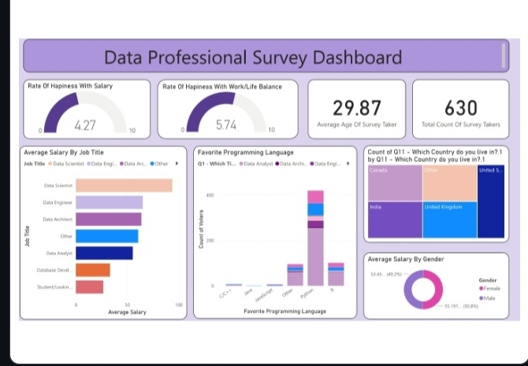

# Data Professionals Survey Analytics

## Table of Contents
- [Project Overview](#project-overview)
- [Data Sources](#data-sources)
- [Tools](#tools)
- [Data Preparation/Cleaning](#data-preparationcleaning)
- [Exploratory Data Analysis](#exploratory-data-analysis)
- [Data Visualization](#data-visualization)
- [Results/Findings](#resultsfindings)
- [Recommendations](#recommendations)

## Project Overview
  By extracting insights from the survey data, the objective of understanding the landscape of the data profession and identifying key trends and patterns has been achieved. The analysis provides valuable insights into the demographics, salary trends, job satisfaction levels, and industry preferences of data professionals.
  
  ## Data Sources
The dataset used for this analysis is sourced from Kaggle Data Professional Survey dataset, comprising responses from data professionals regarding various aspects of their roles, including salary, job satisfaction, industry, and tools usage.

## Tools
- Power BI: For data visualization 
- Excel: For data cleaning

## Data Preparation/Cleaning
- Handling missing values
- Removing duplicates
- Data transformation or normalization

## Exploratory Data Analysis

- What is the gender distribution among the respondents?
- What is the average salary of data professionals?
- What is the average age of the respondents?
- Which job role commands the highest average salary?
- Which education level correlates with the highest average salary?
- What is the most commonly used data tool among respondents?

## Data visualization 

## Results/Findings

- The dashboard shows a balanced diversity effort in terms of target hires, with most departments achieving nearly 50/50 gender representation, except in more senior roles where the male population is higher.

- The average time in job levels indicates that men spend more time in junior roles before being promoted to senior positions, whereas women are promoted more quickly to higher levels.

- Promotion rates for women are lower compared to men, suggesting there could be underlying bias or structural barriers in career progression.

- Turnover rates are highest in the sales and marketing departments and are particularly high among younger employees, which may indicate dissatisfaction or lack of growth opportunities in these areas.

- Women make up a higher percentage of recent hires, but their turnover rate is concerning, particularly in technical roles where they remain underrepresented

## Recommendations

- Increase mentorship and leadership development programs aimed at women in junior and mid-level positions to balance the promotion rates between genders.

- Analyze the high turnover rates in sales and marketing departments to understand the underlying causes and address any issues related to job satisfaction, career growth, or work-life balance.

- Encourage greater retention of women in technical roles by providing more opportunities for career development and creating a more supportive working environment.

- Introduce additional programs to retain younger employees, such as clear career advancement paths or job enrichment opportunities.
